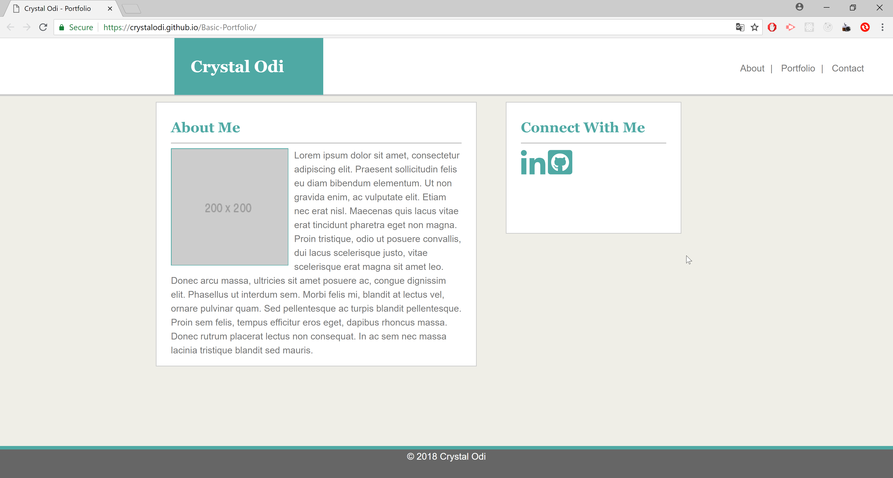
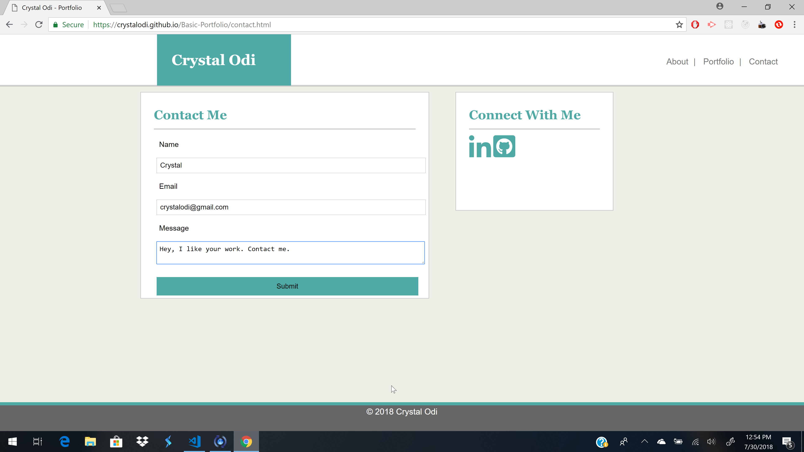
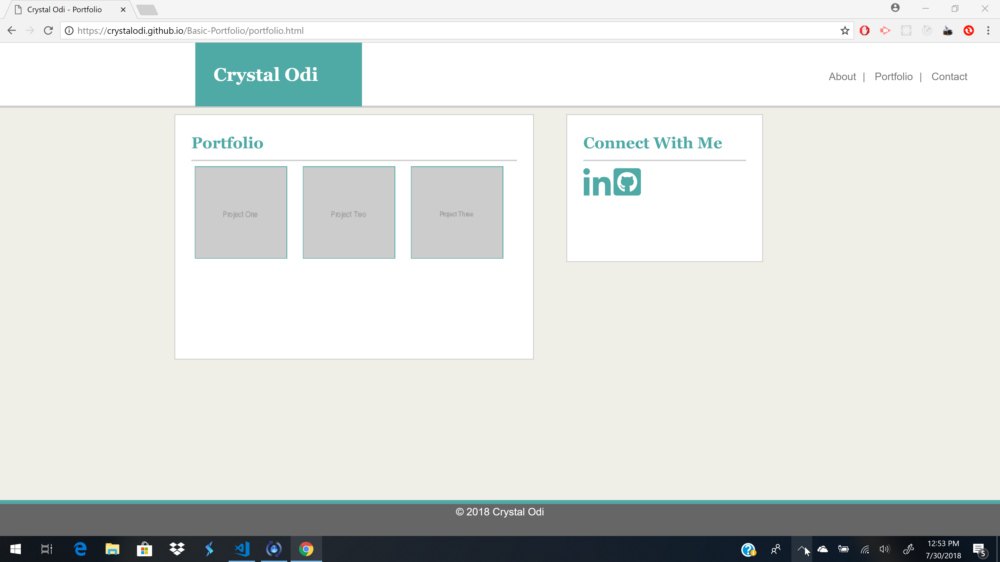

# Responsive Portfolio

Responsive Portfolio is a simple template for a web development portfolio that uses media queries to make the screens responsive for smaller screens. This template includes a projects page,an About page, social media section, and contact page.

## Live Version

Go [here](http://crystalodi.github.io/Responsive-Portfolio/) to view the app. 

## About the Application

## Getting Started

These instructions will get you a copy of the project up and running on your local machine.

### Prerequisites

Install the following programs if they aren't on your local machine.

GIT - https://git-scm.com/book/en/v2/Getting-Started-Installing-Git

### Installing

Open your terminal and clone [this](http://github.com/Responsive-Portfolio/Responsive-Portfolio.git) repository to your computer. 

```
git clone http://github.com/Responsive-Portfolio/Responsive-Portfolio.git

```

Navigate to the `/Responsive-Portfolio` directory with your terminal

```
cd Responsive-Portfolio
```

Open file explorer from the `/Responsive-Portfolio` directory

```
explorer .
```

Open the `index.html` file by double clicking on it. The app will open in a web browser and should look like this:



### Folder Structure
After following the instructions in the installation section, the contents of the `/Responsive-Portfolio` will look like this

```
│   contact.html
│   index.html
│   portfolio.html
│   README.md
│
└───assets
    ├───css
    │       reset.css
    │       style.css
    │
    └───images
            about.png
            contact_me.png
            GitHub-Mark-Light-32px.png
            In-2C-21px-TM.png
            portfolio.png

```
* `assets/css/reset.css` removes any default styling applied by web browsers
* `assets/css/style.css` Contains styling for navbar, header, contact me sidebar, and main content areas. Contains media queries to display template in smaller screens.
* `contact.html` Contains Social media sidebar and form to contact site owner. Also contains navbar and header with name at top to navigate to other pages.
* `images` contains alternate social media icons for github and linkedIn to use in social media sidebar.
* `index.html` Contains Social media sidebar and a section for adding autobiographal and professional details. Also contains navbar and header with name at top to navigate to other pages.
* `portfolio.html` Contains Social media sidebar and a section for adding screenshots and links to other applications. Also contains navbar and header with name at top to navigate to other pages.

## Screenshots

### Contact Page



### About Page


### Portfolio page



## Built With

* HTML
* CSS

## Authors

* **Crystal Odi** - *Initial work* - [crystalodi](https://github.com/crystalodi)


## Acknowledgments

* w3Schools CSS Documentation


